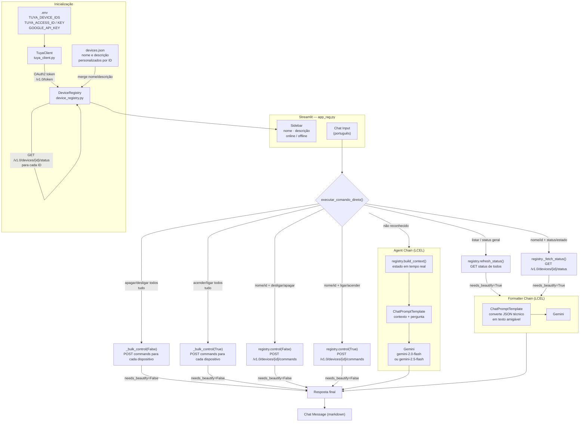

# Architecture — RAG Agent (Dispositivos Inteligentes)

## Workflow



## Ordem de verificação de comandos

A função `executar_comando_direto()` avalia os padrões **nesta ordem** para evitar colisões de substrings (ex: `"ligar"` está contido em `"desligar"`):

1. **Bulk off** — "desligar/apagar" + "todos/tudo"
2. **Bulk on** — "ligar/acender" + "todos/tudo"
3. **Status geral** — "listar", "mostrar todos", "status geral", etc.
4. **Dispositivo específico** — match por ID > match por nome > único dispositivo
   - off antes de on pelo mesmo motivo de substring
5. **Fallback** → Agent Chain com contexto completo

## Como adicionar um novo dispositivo

**1. Registrar o ID** em `.env`:
```
TUYA_DEVICE_IDS=id1,id2,NOVO_ID
```

**2. (Opcional) Personalizar nome e descrição** em `devices.json`:
```json
{
  "NOVO_ID": {
    "name": "Nome amigável",
    "description": "Onde fica e para que serve"
  }
}
```

Sem alteração de código. O `DeviceRegistry` descobre categoria, estado online e status automaticamente via API Tuya.

## Estrutura de arquivos

```
rag_agent/
├── .env                    # Credenciais e TUYA_DEVICE_IDS
├── devices.json            # Nomes e descrições personalizados por device ID
├── requirements.txt
├── CLAUDE.md               # Guia para Claude Code
├── ARCHITECTURE.md         # Este arquivo
└── src/
    ├── app_rag.py          # Streamlit UI, command matching, chains
    ├── tuya_client.py      # Cliente HTTP Tuya (auth HMAC-SHA256)
    └── device_registry.py  # Gerenciamento dinâmico de dispositivos
```

## Fluxo de autenticação Tuya

```
TuyaClient._generate_sign()
  msg = access_id + token + timestamp + METHOD + "\n" + body_sha256 + "\n\n" + path
  sign = HMAC-SHA256(msg, access_key).upper()

Headers enviados:
  client_id, sign, t, sign_method, access_token (após login)
```
