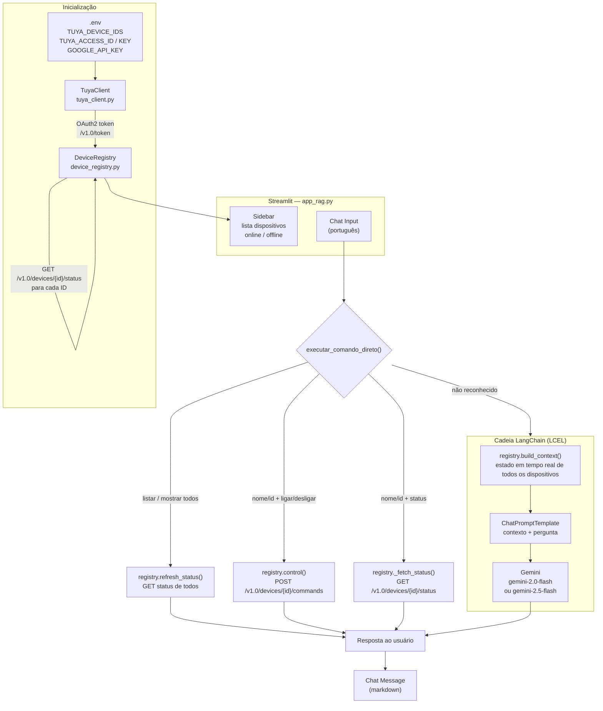

# Architecture — RAG Agent (Dispositivos Inteligentes)

## Workflow



## Como adicionar um novo dispositivo

```
# .env
TUYA_DEVICE_IDS=id_existente_1,id_existente_2,NOVO_ID
```

Nenhuma alteração de código é necessária. Na próxima inicialização, o `DeviceRegistry` consulta a API Tuya para obter nome, categoria e status do novo dispositivo automaticamente.

## Estrutura de arquivos

```
rag_agent/
├── .env                    # Credenciais e lista de dispositivos
├── requirements.txt
├── CLAUDE.md               # Guia para Claude Code
├── ARCHITECTURE.md         # Este arquivo
└── src/
    ├── app_rag.py          # Streamlit UI + lógica de comandos
    ├── tuya_client.py      # Cliente HTTP Tuya (auth HMAC-SHA256)
    └── device_registry.py  # Gerenciamento dinâmico de dispositivos
```

## Fluxo de autenticação Tuya

```
TuyaClient._generate_sign()
  msg = access_id + token + timestamp + METHOD + "\n" + body_sha256 + "\n\n" + path
  sign = HMAC-SHA256(msg, access_key).upper()

Headers enviados:
  client_id, sign, t, sign_method, access_token (após login)
```
